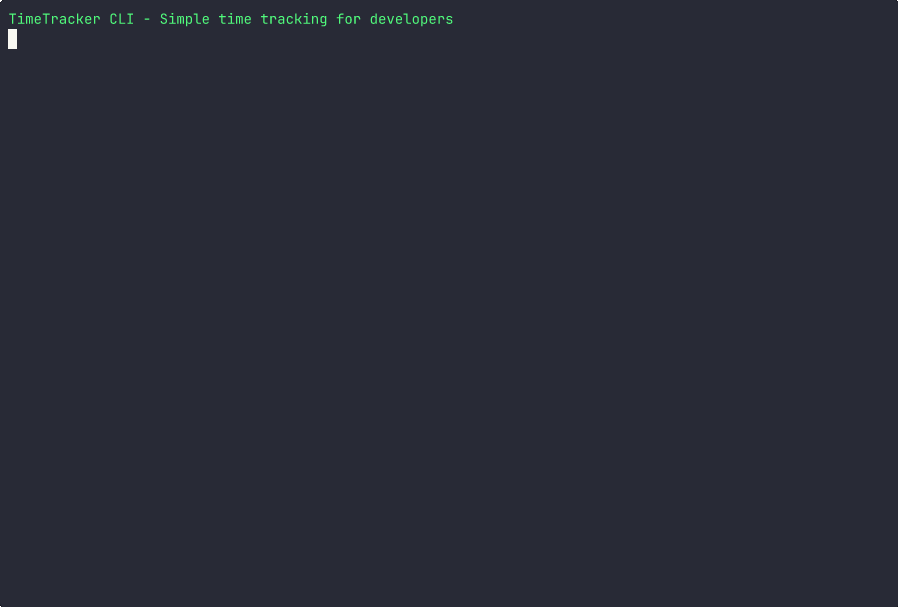

# timetracker-cli

A simple command line time tracking tool for developers.



## Installation

```bash
npm install -g @mvexel/timetracker-cli
```

## Usage

### Basic Time Tracking

```bash
# Start tracking a project (auto-creates project)
tt start <project_name> [description]

# Start with description
tt start client-website "fixing responsive layout"

# Stop tracking current session
tt stop
```

### Manual Logging

```bash
# Log time for a project (duration in minutes)
tt log <project_name> <duration_in_minutes> [description]

# Log with description
tt log myproject 120 "code review session"

# Log for specific day
tt log myproject 60 "bug fixes" --day 2024-01-15
```

### Viewing Data

Most of these support a `--json` parameter.

```bash
# Show time summary for all projects
tt summary [period]

# Show summary for specific project
tt summary --project myproject

# Show log entries
tt logs [period]

# Show only session entries (start/stop)
tt logs --sessions-only

# Show only manual entries
tt logs --manual-only

# Show only entries with descriptions
tt logs --with-descriptions

# Available periods: day, week, month, all (default: all)
```

### Project Management

```bash
# List all projects with stats
tt projects

# Delete project and all its entries
tt project delete myproject. # this is the same as tt delete --project myproject
```

#### Project Hierarchy

You can organize projects hierarchically using the `/` separator. For example:

```bash
# Log time to parent and child projects
tt log business 30 "General business tasks"
tt log business/quote 120 "Quote preparation"
tt log business/invoicing 60 "Invoice processing"
tt log business/admin 45 "Administrative work"
```

When viewing projects, the hierarchy is displayed with indentation:

```bash
tt projects
```

Output:
```
Projects:
business: 4h 15m (1 entries)
  Direct: 30m
  business/admin: 45m (1 entries)
  business/invoicing: 1h 0m (1 entries)
  business/quote: 2h 0m (1 entries)
```

- Parent projects show **total time** (including all subprojects)
- **Direct:** shows time logged directly to the parent project
- Child projects are indented and show their individual time

You can filter summaries by parent project to see all related work:

```bash
tt summary --project business
```

This will include all `business/*` subprojects in the summary.

### Deleting Entries

You can delete entries by project, time range, or a combination of both. You can also manually edit the log file.

```bash
# Delete by project and time range
tt delete --project myproject --last     # Most recent entry
tt delete --project myproject --today    # All today's entries

# Delete by time range only (all projects)
tt delete --last      # Most recent entry
tt delete --today     # All today's entries
tt delete --week      # This week's entries
tt delete --month     # This month's entries
```

### Data Export

```bash
# Export to file
tt export > backup.csv
```

### `zsh` integration

I don't use bash, if you do, please submit :)

#### Prompt

Add this to your `~/.zshrc` to add your current session to your prompt

```bash
timetracker_prompt() {
  local tt_status=$(tt status 2>/dev/null)
  if [[ -n "$tt_status" ]]; then
    echo "%F{yellow}$tt_status%f "
  fi
}
setopt PROMPT_SUBST
PROMPT='$(timetracker_prompt)%F{blue}%~%f $ '
```

#### Completions

There's a completions function in `extras/zsh` you can use. This provides completions for the subcommands and options as well as project names.

## Data Storage

Time tracking data is stored in your home directory at `~/.timetracker/`:

- `state.json`: Current tracking session state
- `timetracker.csv`: Session entries with date, duration, description, and session ID

## License

MIT
